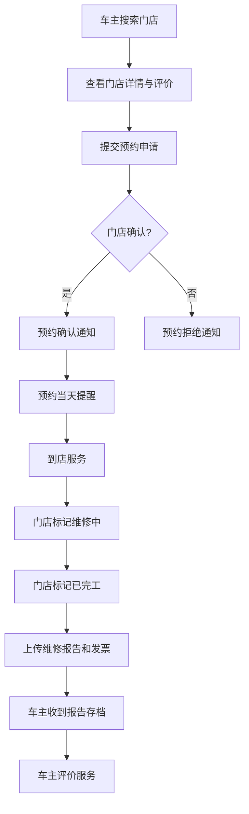
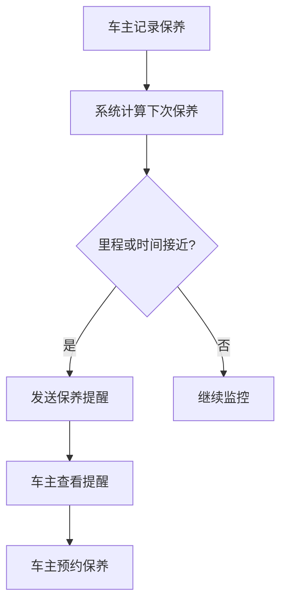

## 1. 产品概述

汽车保养维修记录与预约系统，帮助车主管理车辆保养维修全生命周期——从绑定车辆、记录每次服务、智能提醒下次保养/保险/年检到期，到在地图上搜索合作门店、在线预约、服务评价，同时为门店端提供工单管理与报告上传能力。

- 目标用户：私家车主、汽车维修/保养门店
- 核心价值：消除保养遗忘、简化预约流程、建立透明可信的车主-门店服务闭环

## 2. 核心功能

### 2.1 用户角色

| 角色 | 注册方式 | 核心权限 |
|------|----------|----------|
| 车主 | 手机号注册 | 绑定车辆、记录服务、搜索门店、在线预约、评价服务 |
| 门店 | 手机号注册+资质审核 | 管理工单、确认预约、标记维修状态、上传报告和发票 |

### 2.2 功能模块

1. **车主端 - 车辆管理**：绑定车辆信息、查看车辆详情、编辑/删除车辆
2. **车主端 - 服务记录**：新增保养/维修记录、查看历史记录、费用统计
3. **车主端 - 智能提醒**：保养里程/时间提醒、保险到期提醒、年检到期提醒
4. **车主端 - 门店搜索**：地图搜索附近门店、查看门店详情与评价
5. **车主端 - 在线预约**：选择门店与服务时间、预约状态跟踪、预约提醒
6. **车主端 - 服务评价**：对已完成服务打分与评论
7. **门店端 - 工单管理**：查看所有预约、确认/拒绝预约、标记维修状态
8. **门店端 - 报告上传**：上传维修报告、上传发票照片、发送给车主存档

### 2.3 页面详情

| 页面名称 | 模块名称 | 功能描述 |
|----------|----------|----------|
| 登录/注册页 | 登录表单 | 手机号+验证码登录，角色选择（车主/门店） |
| 车主首页 | 提醒卡片 | 显示待办提醒（保养/保险/年检），快捷入口 |
| 车主首页 | 车辆概览 | 已绑定车辆列表、每辆车当前里程与下次保养提示 |
| 车辆管理页 | 添加车辆 | 表单：品牌、型号、购车日期、当前里程、车牌号 |
| 车辆管理页 | 车辆详情 | 车辆基本信息、服务历史时间线、提醒设置 |
| 服务记录页 | 新增记录 | 选择保养/维修类型、服务项目（换机油/刹车片等）、费用、里程、门店 |
| 服务记录页 | 历史记录 | 按车辆筛选、时间线展示、费用汇总统计 |
| 提醒中心页 | 提醒列表 | 保养提醒、保险到期、年检到期，按紧急程度排序 |
| 提醒中心页 | 提醒设置 | 自定义保养间隔里程/时间、保险/年检日期 |
| 门店搜索页 | 地图视图 | 地图上显示附近合作门店标记，支持缩放拖动 |
| 门店搜索页 | 门店列表 | 门店名称、距离、评分、主营项目，支持筛选排序 |
| 门店详情页 | 门店信息 | 地址、营业时间、联系方式、服务项目、用户评价列表 |
| 预约页 | 预约表单 | 选择车辆、服务项目、预约日期时间段、备注 |
| 预约页 | 预约状态 | 待确认/已确认/进行中/已完成/已取消 |
| 评价页 | 评价表单 | 星级评分（1-5）、文字评论、标签选择 |
| 门店首页 | 今日工单 | 今日预约列表、状态筛选、紧急工单高亮 |
| 门店首页 | 数据概览 | 本月预约数、完工数、好评率 |
| 工单管理页 | 工单列表 | 全部预约工单、状态筛选、搜索 |
| 工单管理页 | 工单详情 | 车主信息、车辆信息、预约服务、确认/拒绝、标记状态 |
| 工单详情页 | 报告上传 | 上传维修报告（文字+图片）、上传发票照片 |

## 3. 核心流程

### 3.1 车主预约流程
车主打开门店搜索 → 查看附近门店 → 选择门店查看详情与评价 → 点击预约 → 选择车辆/服务/时间 → 提交预约 → 门店收到通知并确认 → 车主收到确认通知 → 预约当天提前提醒 → 到店服务 → 完工后车主评价

### 3.2 保养提醒流程
车主记录保养服务 → 系统记录当前里程和保养类型 → 根据保养类型推荐间隔（如机油5000km/6个月）→ 当里程接近或时间接近时发送提醒 → 车主查看提醒并预约保养

### 3.3 门店工单流程
门店收到新预约通知 → 查看工单详情 → 确认/拒绝预约 → 车主收到通知 → 服务日开始维修 → 标记"维修中" → 完成维修 → 标记"已完工" → 上传维修报告和发票 → 车主收到存档

## 4. 用户界面设计

### 4.1 设计风格

- **主色调**：深蓝灰 (#1B2A4A) + 琥珀橙 (#F59E0B) 作为强调色，传达专业可靠与活力
- **辅助色**：暖灰 (#F3F4F6) 背景、成功绿 (#10B981)、警告红 (#EF4444)
- **按钮风格**：圆角 8px，主按钮实色填充，次按钮描边，带微妙阴影
- **字体**：标题使用 "DM Sans"（粗体醒目），正文使用 "Noto Sans SC"（中文友好）
- **布局风格**：左侧导航栏 + 右侧内容区，卡片式布局，适度圆角和阴影
- **图标风格**：线性图标，2px 描边，统一使用 Lucide 图标库

### 4.2 页面设计概览

| 页面名称 | 模块名称 | UI 元素 |
|----------|----------|----------|
| 登录/注册页 | 登录表单 | 居中卡片，深色渐变背景，手机号输入+验证码，角色切换标签，琥珀色主按钮 |
| 车主首页 | 提醒卡片 | 顶部横幅提醒区，红/橙/绿三级紧急度色标，右侧快捷操作按钮 |
| 车主首页 | 车辆概览 | 水平卡片列表，每卡含车辆缩略图、品牌型号、里程进度条、下次保养倒计时 |
| 车辆管理页 | 添加车辆 | 滑出式侧边面板，分步表单（品牌→型号→日期里程），品牌选择网格 |
| 服务记录页 | 新增记录 | 模态弹窗，服务项目多选标签，费用输入，里程输入，门店关联选择 |
| 服务记录页 | 历史记录 | 纵向时间线，左时间右卡片，费用饼图统计，筛选器 |
| 提醒中心页 | 提醒列表 | 卡片列表，左侧色条标识类型，右侧操作按钮（去预约/标记处理） |
| 门店搜索页 | 地图视图 | 左侧地图（占60%），右侧门店列表面板（占40%），地图标记带评分气泡 |
| 门店详情页 | 门店信息 | 顶部封面图，评分星级，服务项目标签，评价列表带头像 |
| 预约页 | 预约表单 | 步骤条导航（选车辆→选服务→选时间），日历时间选择器 |
| 门店首页 | 今日工单 | 左侧统计卡片行，下方工单列表，状态色标标签 |
| 工单详情页 | 报告上传 | 拖拽上传区域，图片预览网格，文字报告编辑器 |

### 4.3 响应式设计

- 桌面优先设计，最小宽度 1280px
- 平板适配：导航栏折叠为汉堡菜单，地图与列表上下排列
- 移动端：底部Tab导航，全宽卡片，地图全屏模式

### 4.4 动效设计

- 页面切换：淡入 + 轻微上移 8px
- 卡片悬浮：阴影加深 + 轻微上浮 2px
- 提醒卡片：新提醒从顶部滑入
- 按钮：点击缩放 0.97 + 回弹
- 地图标记：脉冲动画吸引注意
- 预约确认：成功勾号动画
