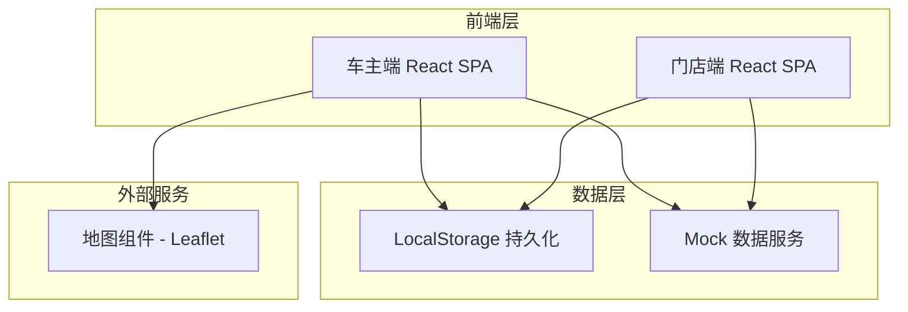
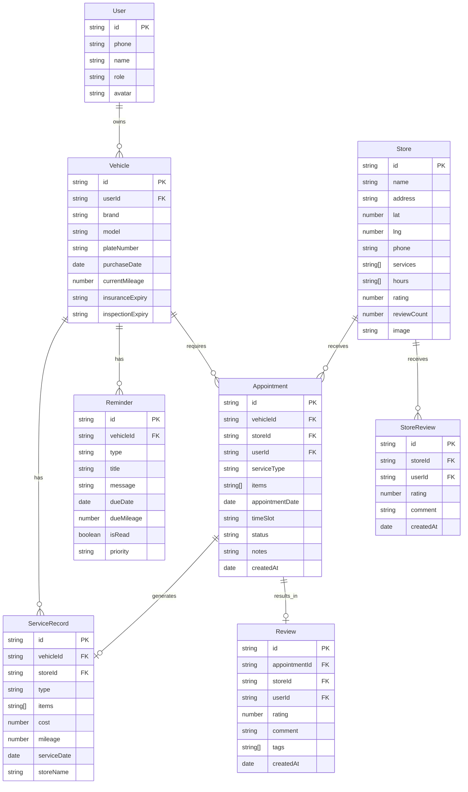

## 1. 架构设计



本系统采用纯前端架构，使用 LocalStorage 进行数据持久化，Mock 数据模拟后端 API，地图使用开源 Leaflet 方案。

## 2. 技术说明

- **前端框架**：React@18 + TypeScript
- **样式方案**：Tailwind CSS@3
- **构建工具**：Vite
- **路由**：React Router v6
- **状态管理**：React Context + useReducer
- **地图**：Leaflet + React-Leaflet（开源免费）
- **图标**：Lucide React
- **字体**：DM Sans + Noto Sans SC（Google Fonts）
- **后端**：无（Mock 数据 + LocalStorage）
- **数据库**：LocalStorage + 内存 Mock 数据

## 3. 路由定义

| 路由 | 用途 |
|------|------|
| `/login` | 登录/注册页面 |
| `/owner` | 车主首页（提醒+车辆概览） |
| `/owner/vehicles` | 车辆管理页 |
| `/owner/vehicles/:id` | 车辆详情页 |
| `/owner/records` | 服务记录页 |
| `/owner/reminders` | 提醒中心页 |
| `/owner/stores` | 门店搜索页（地图+列表） |
| `/owner/stores/:id` | 门店详情页 |
| `/owner/appointments` | 我的预约页 |
| `/owner/appointments/:id` | 预约详情/评价页 |
| `/store` | 门店首页（今日工单+数据概览） |
| `/store/orders` | 工单管理页 |
| `/store/orders/:id` | 工单详情页（含报告上传） |

## 4. 数据模型

### 4.1 数据模型定义



### 4.2 数据定义

```sql
-- 用户表
CREATE TABLE users (
  id TEXT PRIMARY KEY,
  phone TEXT NOT NULL,
  name TEXT NOT NULL,
  role TEXT NOT NULL CHECK(role IN ('owner', 'store')),
  avatar TEXT
);

-- 车辆表
CREATE TABLE vehicles (
  id TEXT PRIMARY KEY,
  user_id TEXT NOT NULL REFERENCES users(id),
  brand TEXT NOT NULL,
  model TEXT NOT NULL,
  plate_number TEXT,
  purchase_date DATE,
  current_mileage INTEGER DEFAULT 0,
  insurance_expiry DATE,
  inspection_expiry DATE
);

-- 服务记录表
CREATE TABLE service_records (
  id TEXT PRIMARY KEY,
  vehicle_id TEXT NOT NULL REFERENCES vehicles(id),
  store_id TEXT REFERENCES stores(id),
  type TEXT NOT NULL CHECK(type IN ('maintenance', 'repair')),
  items TEXT NOT NULL,
  cost REAL DEFAULT 0,
  mileage INTEGER,
  service_date DATE NOT NULL,
  store_name TEXT
);

-- 提醒表
CREATE TABLE reminders (
  id TEXT PRIMARY KEY,
  vehicle_id TEXT NOT NULL REFERENCES vehicles(id),
  type TEXT NOT NULL CHECK(type IN ('maintenance', 'insurance', 'inspection')),
  title TEXT NOT NULL,
  message TEXT,
  due_date DATE,
  due_mileage INTEGER,
  is_read BOOLEAN DEFAULT FALSE,
  priority TEXT DEFAULT 'medium'
);

-- 门店表
CREATE TABLE stores (
  id TEXT PRIMARY KEY,
  name TEXT NOT NULL,
  address TEXT NOT NULL,
  lat REAL NOT NULL,
  lng REAL NOT NULL,
  phone TEXT,
  services TEXT,
  hours TEXT,
  rating REAL DEFAULT 0,
  review_count INTEGER DEFAULT 0,
  image TEXT
);

-- 预约表
CREATE TABLE appointments (
  id TEXT PRIMARY KEY,
  vehicle_id TEXT NOT NULL REFERENCES vehicles(id),
  store_id TEXT NOT NULL REFERENCES stores(id),
  user_id TEXT NOT NULL REFERENCES users(id),
  service_type TEXT NOT NULL,
  items TEXT,
  appointment_date DATE NOT NULL,
  time_slot TEXT NOT NULL,
  status TEXT DEFAULT 'pending' CHECK(status IN ('pending', 'confirmed', 'in_progress', 'completed', 'cancelled', 'rejected')),
  notes TEXT,
  created_at DATETIME DEFAULT CURRENT_TIMESTAMP,
  report_text TEXT,
  report_images TEXT,
  invoice_images TEXT
);

-- 评价表
CREATE TABLE reviews (
  id TEXT PRIMARY KEY,
  appointment_id TEXT NOT NULL REFERENCES appointments(id),
  store_id TEXT NOT NULL REFERENCES stores(id),
  user_id TEXT NOT NULL REFERENCES users(id),
  rating INTEGER NOT NULL CHECK(rating BETWEEN 1 AND 5),
  comment TEXT,
  tags TEXT,
  created_at DATETIME DEFAULT CURRENT_TIMESTAMP
);
```

## 5. Mock 数据策略

系统内置丰富的 Mock 数据以支持完整功能演示：

- **门店数据**：预置 15+ 家合作门店，含经纬度、评分、服务项目
- **车辆数据**：预置 3 辆不同品牌车辆，含完整信息
- **服务记录**：预置 20+ 条历史服务记录
- **提醒数据**：根据车辆里程和日期动态生成保养/保险/年检提醒
- **预约数据**：预置不同状态的预约工单

所有数据通过 LocalStorage 持久化，首次加载时初始化 Mock 数据。
